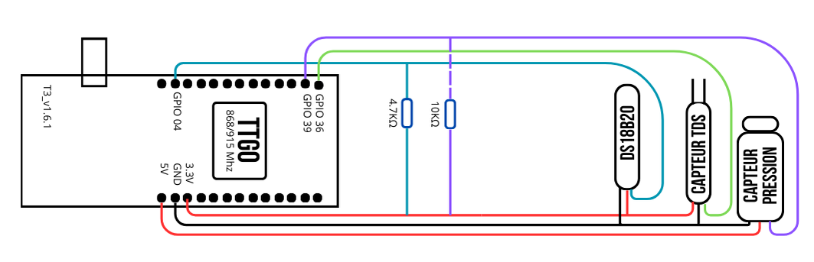

# PONTCONNECT - Système de Surveillance Aquatique IoT

## Table des matières

1. [Présentation du projet](#présentation-du-projet)
2. [Matériel nécessaire](#matériel-nécessaire)
3. [Schéma de connexion](#schéma-de-connexion)
4. [Installation du logiciel](#installation-du-logiciel)
5. [Configuration](#configuration)
6. [Déploiement](#déploiement)
7. [Décodage des données](#décodage-des-données)
8. [Dépannage](#dépannage)

## Présentation du projet

**PONTCONNECT** est un système IoT autonome permettant la surveillance en temps réel des conditions aquatiques sur un pont. Conçu pour les ponts et ports, il mesure trois paramètres clés :

- **Température de l'eau** (précision 0.1°C)
- **Qualité de l'eau** (mesure de turbidité en ppm)
- **Profondeur** (en cm)

Les données sont affichées sur un écran OLED intégré et transmises via LoRaWAN à un serveur distant (ChirpStack) pour analyse et archivage.

## Matériel nécessaire

- **Carte TTGO LoRa32 V2.1** (ESP32 + module LoRa SX1276)
- **Capteur de température** DS18B20 (étanche)
- **Capteur de turbidité** (capteur TDS analogique)
- **Capteur de pression** pour mesure de profondeur
- **Résistance 4.7kΩ** (pour le DS18B20)
- **Résistance 10kΩ** (pour le capteur de pression)
- **Câbles et connecteurs** étanches
- **Boîtier étanche** (recommandé IP67 minimum)
- **Alimentation** (batterie LiPo ou panneau solaire + régulateur) **_si nécessaire_**

## Schéma de connexion


[Schéma carte TTGO LoRa32 V2.1](https://github.com/LilyGO/TTGO-LoRa32-V2.1)

## Installation du logiciel

### 1. Prérequis

- Installation de [PlatformIO](https://platformio.org/)
- [VS Code](https://code.visualstudio.com/) recommandé comme environnement

### 2. Cloner le projet

```bash
git clone https://github.com/wicra/pontconnect-iot.git
cd pontconnect
```

## Configuration

### 1. Configuration LoRaWAN

Modifiez les identifiants LoRaWAN dans `main.cpp` :

```cpp
static const u1_t PROGMEM APPEUI[8]  = { 0x00, 0x00, 0x00, 0x00, 0x00, 0x00, 0x00, 0x00 };
static const u1_t PROGMEM DEVEUI[8]  = { 0x00, 0x00, 0x00, 0x00, 0x00, 0x00, 0x00, 0x00 };
static const u1_t PROGMEM APPKEY[16] = { 0x00, 0x00, 0x00, 0x00, 0x00, 0x00, 0x00, 0x00, 0x00, 0x00, 0x00, 0x00, 0x00, 0x00, 0x00, 0x00 };
```

⚠️ **Important** : Les clés sont en format MSB (Most Significant Byte first) comme indiqué en commentaire.

⚠️ **Important** : Pour plus d'informations, consultez [ttgo-lora32](https://github.com/alexwauquier/ttgo-lora32)

### 2. Configuration des capteurs

Si votre capteur TDS ou de pression nécessite une calibration spécifique, ajustez ces formules :

```cpp
// Formule TDS
float qppm = (133.42f*vTDS*vTDS*vTDS - 255.86f*vTDS*vTDS + 857.39f*vTDS)*0.5f;

// Formule profondeur
float depth = max(0.0f, (vP - 0.5f) / 0.05f);
```

### 3. Intervalle de transmission

Par défaut, les données sont envoyées toutes les 60 secondes :

```cpp
const unsigned TX_INTERVAL = 60;
```

Modifiez cette valeur selon vos besoins, en respectant les limitations de duty cycle de votre région (1% en Europe).

## Déploiement

### 1. Compiler et téléverser

Avec PlatformIO :

```bash
pio run --target upload
```

### 2. Surveillez la console série

Ouvrez un terminal série à 115200 bauds pour surveiller les logs :

```bash
pio device monitor -b 115200
```

Vous devriez voir :

```
------ PONTCONNECT STATUS ------
Température: 22.5 °C
Qualité eau: 450 ppm
Profondeur: 1.8 cm
------------------------------
LoRa: ENVOI
en cours...
```

### 3. Configuration de ChirpStack

1. Créez une nouvelle application
2. Ajoutez votre appareil avec les mêmes identifiants que dans le code
3. Configurez le décodeur de charge utile (voir section suivante)

## Décodage des données

### Format du payload

Le dispositif envoie 6 octets :

- Octets 0-1 : Température (°C × 100), format int16_t
- Octets 2-3 : Turbidité (ppm), format uint16_t
- Octets 4-5 : Profondeur (cm × 10), format uint16_t

### Décodeur JavaScript pour ChirpStack

Dans l'interface ChirpStack, ajoutez ce décodeur :

```javascript
function Decode(fPort, bytes) {
  if (bytes.length < 6) {
    return { error: "Payload trop court" };
  }

  // Décodage température (octets 0-1, format int16)
  var tempRaw = (bytes[1] << 8) | bytes[0];
  if (tempRaw & 0x8000) {
    tempRaw = tempRaw - 0x10000;
  }
  var temperature = tempRaw / 100.0;

  // Décodage turbidité TDS (octets 2-3, format uint16)
  var tdsRaw = (bytes[3] << 8) | bytes[2];
  var turbidity = tdsRaw;

  // Décodage profondeur (octets 4-5, format uint16)
  var depthRaw = (bytes[5] << 8) | bytes[4];
  var depth = depthRaw / 10.0;

  return {
    temperature: {
      value: temperature,
      unit: "°C",
    },
    turbidity: {
      value: turbidity,
      unit: "ppm",
    },
    depth: {
      value: depth,
      unit: "cm",
    },
  };
}
```

### Script Python pour décodage manuel

Pour tester un payload manuellement :

```python
#!/usr/bin/env python3

def decode_pontconnect(hex_payload):
    # Convertir hex en bytes
    if hex_payload.startswith('0x'):
        hex_payload = hex_payload[2:]

    bytes_data = bytearray.fromhex(hex_payload)

    # Température (octets 0-1)
    temp_raw = bytes_data[0] | (bytes_data[1] << 8)
    if temp_raw & 0x8000:
        temp_raw = temp_raw - 0x10000
    temperature = temp_raw / 100.0

    # Turbidité TDS (octets 2-3)
    tds_raw = bytes_data[2] | (bytes_data[3] << 8)
    turbidity = tds_raw

    # Profondeur (octets 4-5)
    depth_raw = bytes_data[4] | (bytes_data[5] << 8)
    depth = depth_raw / 10.0

    return {
        "temperature": temperature,
        "turbidity": turbidity,
        "depth": depth
    }

# Exemple : d00800001200 = 22.56°C, 0ppm, 1.8cm
payload = input("Entrez le payload hexadécimal : ")
data = decode_pontconnect(payload)
print(f"Température : {data['temperature']}°C")
print(f"Turbidité : {data['turbidity']}ppm")
print(f"Profondeur : {data['depth']}cm")
```

## Dépannage

### Problèmes courants et solutions

| Problème                             | Solution                                                  |
| ------------------------------------ | --------------------------------------------------------- |
| Erreur de lecture du capteur DS18B20 | Vérifiez la résistance pull-up de 4.7kΩ                   |
| "OP_TXRXPEND, not sending"           | Le dispositif attend la fin d'une transmission précédente |
| "EV_JOINING" mais pas de "EV_JOINED" | Vérifiez les clés LoRaWAN et la couverture                |
| "No RX Data"                         | Normal si aucun downlink n'est envoyé depuis le serveur   |
| Mesures de profondeur incorrectes    | Recalibrez la formule du capteur de pression              |
| Consommation d'énergie élevée        | Augmentez TX_INTERVAL et utilisez le mode deep sleep      |

### :link: Liens utiles

- Pour la communication LoRaWAN, voici le projet d'Alex sur lequel je me suis appuyé : [ttgo-lora32](https://github.com/alexwauquier/ttgo-lora32)
- [Documentation PlatformIO](https://docs.platformio.org/en/latest/)
- [Documentation The Things Network](https://www.thethingsnetwork.org/docs/)
- [Wikipédia - Numérotation des bits (LSB et MSB)](https://fr.wikipedia.org/wiki/Num%C3%A9ration_des_bits)

&copy; 2025 PONTCONNECT - Système de surveillance aquatique IoT
