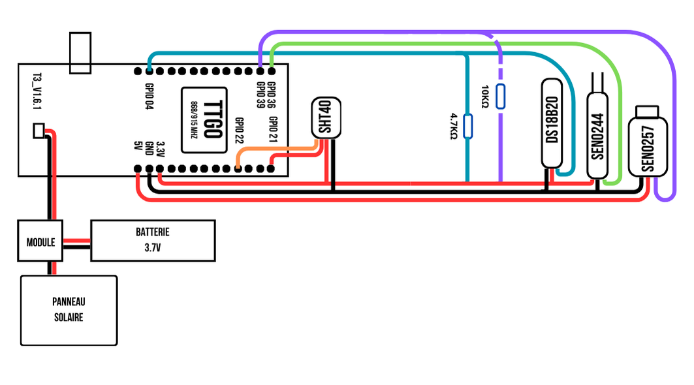

<div align="center">
  
  <h1>Système de Surveillance Aquatique IoT</h1>
  <p>
    <a href="#présentation-du-projet"><strong>Explorer la documentation »</strong></a>
    <br />
    <br />
    <a href="https://github.com/wicra/pontconnect-iot/issues">Signaler un bug</a>
    ·
    <a href="https://github.com/wicra/pontconnect-iot/issues">Demander une fonctionnalité</a>
  </p>
</div>

## Table des matières

- [Table des matières](#table-des-matières)
- [Présentation du projet](#présentation-du-projet)
- [Matériel nécessaire](#matériel-nécessaire)
- [Schéma de connexion](#schéma-de-connexion)
- [Installation du logiciel](#installation-du-logiciel)
  - [1. Prérequis](#1-prérequis)
  - [2. Cloner le projet](#2-cloner-le-projet)
- [Configuration](#configuration)
  - [1. Configuration LoRaWAN](#1-configuration-lorawan)
- [Déploiement](#déploiement)
  - [1. Compiler et téléverser](#1-compiler-et-téléverser)
- [Dépannage](#dépannage)
  - [Problèmes courants et solutions](#problèmes-courants-et-solutions)
  - [:link: Liens utiles](#link-liens-utiles)

## Présentation du projet

**PONTCONNECT** est un système IoT autonome permettant la surveillance en temps réel des conditions aquatiques sur un pont. Conçu pour les ponts et ports, il mesure trois paramètres clés :

- **Température de l'eau** (précision 0.1°C)
- **Qualité de l'eau** (mesure de turbidité en ppm)
- **Profondeur** (en cm)

Les données sont affichées sur un écran OLED intégré et transmises via LoRaWAN à un serveur distant (ChirpStack).

## Matériel nécessaire

- **Carte TTGO LoRa32 V2.1** (ESP32 + module LoRa SX1276)
- **Capteur de température** DS18B20 (étanche)
- **Capteur de turbidité** (capteur TDS analogique)
- **Capteur de pression** pour mesure de profondeur
- **Résistance 4.7kΩ** (pour le DS18B20)
- **Résistance 10kΩ** (pour le capteur de pression)
- **Câbles et connecteurs** étanches
- **Boîtier étanche** (recommandé IP67 minimum)
- **Alimentation** (batterie LiPo ou panneau solaire + régulateur) **_si nécessaire_**
- **Raspberry Pi** (Serveur ChirpStack)
- **Passerelle LoRaWAN**

## Schéma de connexion



[Schéma carte TTGO LoRa32 V2.1](https://github.com/LilyGO/TTGO-LoRa32-V2.1)

## Installation du logiciel

### 1. Prérequis

- Installation de [PlatformIO](https://platformio.org/)
- [VS Code](https://code.visualstudio.com/) recommandé comme environnement

### 2. Cloner le projet

```bash
git clone --depth 1 --filter=blob:none --sparse https://github.com/wicra/pontconnect-iot.git
cd pontconnect-iot
git sparse-checkout set iot
```

## Configuration

### 1. Configuration LoRaWAN

Modifiez les identifiants LoRaWAN dans `main.cpp` :

```cpp
static const u1_t PROGMEM APPEUI[8]  = { 0x00, 0x00, 0x00, 0x00, 0x00, 0x00, 0x00, 0x00 };
static const u1_t PROGMEM DEVEUI[8]  = { 0x00, 0x00, 0x00, 0x00, 0x00, 0x00, 0x00, 0x00 };
static const u1_t PROGMEM APPKEY[16] = { 0x00, 0x00, 0x00, 0x00, 0x00, 0x00, 0x00, 0x00, 0x00, 0x00, 0x00, 0x00, 0x00, 0x00, 0x00, 0x00 };
```

⚠️ **Important** : Pour plus d'informations sur le format des clés, consultez [ttgo-lora32](https://github.com/alexwauquier/ttgo-lora32)

## Déploiement

### 1. Compiler et téléverser

Avec PlatformIO :

```bash
pio run --target upload
```

## Dépannage

### Problèmes courants et solutions

| Problème                             | Solution                                                  |
| ------------------------------------ | --------------------------------------------------------- |
| Erreur de lecture du capteur DS18B20 | Vérifiez la résistance pull-up de 4.7kΩ                   |
| "OP_TXRXPEND, not sending"           | Le dispositif attend la fin d'une transmission précédente |
| "EV_JOINING" mais pas de "EV_JOINED" | Vérifiez les clés LoRaWAN et la couverture                |
| "No RX Data"                         | Normal si aucun downlink n'est envoyé depuis le serveur   |
| Mesures de profondeur incorrectes    | Recalibrez la formule du capteur de pression              |
| Consommation d'énergie élevée        | Augmentez TX_INTERVAL et utilisez le mode deep sleep      |

### :link: Liens utiles

- [Configuration ChirpStack](chirpstack/config.md)
- [Documentation du script MQTT vers DB](send-db/config.md)
- [Communication LoRaWAN (projet de référence)](https://github.com/alexwauquier/ttgo-lora32)
- [Documentation PlatformIO](https://docs.platformio.org/en/latest/)
- [Documentation The Things Network](https://www.thethingsnetwork.org/docs/)
- [Wikipédia - Numérotation des bits (LSB et MSB)](https://fr.wikipedia.org/wiki/Num%C3%A9ration_des_bits)

---

<p align="center">
&copy; 2025 PONTCONNECT - Système de surveillance aquatique IoT
</p>
