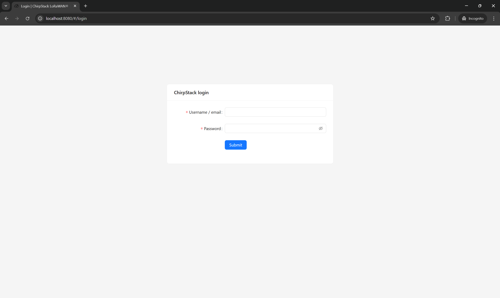
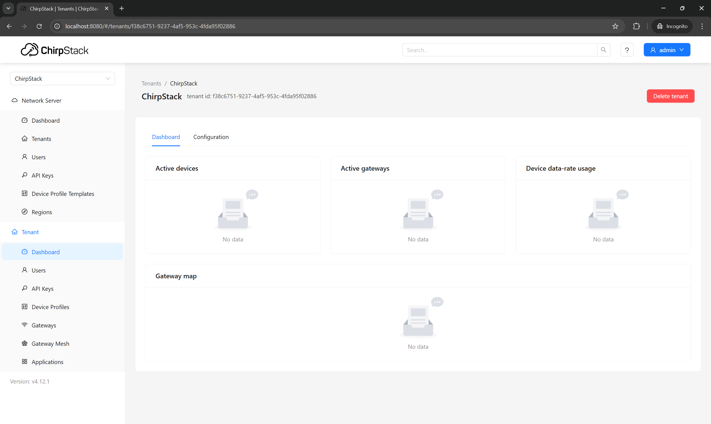
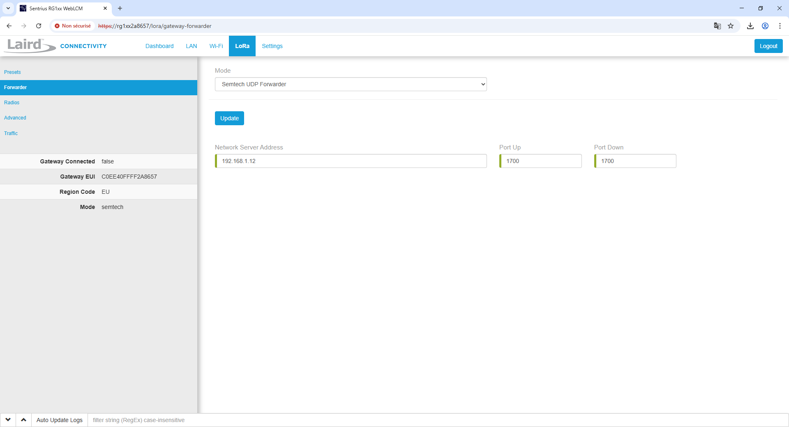

# Guide de configuration ChirpStack pour PONTCONNECT

Ce guide vous explique comment configurer le serveur ChirpStack pour recevoir et décoder les données de votre dispositif PONTCONNECT.

## Table des matières

- [Guide de configuration ChirpStack pour PONTCONNECT](#guide-de-configuration-chirpstack-pour-pontconnect)
  - [Table des matières](#table-des-matières)
  - [Connexion à ChirpStack](#connexion-à-chirpstack)
  - [Configuration de l'application](#configuration-de-lapplication)
  - [Configuration du service LoRa](#configuration-du-service-lora)
  - [Enregistrement de l'appareil](#enregistrement-de-lappareil)

## Connexion à ChirpStack

1. Ouvrez votre navigateur et accédez à l'adresse IP de votre serveur ChirpStack
2. Utilisez vos identifiants pour vous connecter

Après la connexion, vous verrez le tableau de bord principal :

## Configuration de l'application

Pour gérer vos appareils PONTCONNECT :

1. Retournez au tableau de bord ChirpStack
2. Accédez à "Applications"
3. Cliquez sur "Add Application"
4. Renseignez :
   - Nom de l'application (ex : "PONTCONNECT")
   - Description (ex : "Surveillance aquatique")
   - Service profile : sélectionnez un profil adapté

## Configuration du service LoRa

Dans la section LoRa de votre passerelle :

1. Accédez à la page "Forwarder"
2. Configurez l'adresse de votre serveur ChirpStack

## Enregistrement de l'appareil

Pour chaque dispositif PONTCONNECT :

1. Dans votre application, cliquez sur "Devices"
2. Cliquez sur "Add device"
3. Entrez :
   - Device EUI : identifiant unique du dispositif (visible dans le code)
   - Device name : nom de votre dispositif
   - Device profile : sélectionnez un profil adapté
4. Sur la page suivante, configurez les clés de sécurité :
   - Application key : clé utilisée pour chiffrer les communications

&copy; 2025 PONTCONNECT - Guide de configuration ChirpStack
