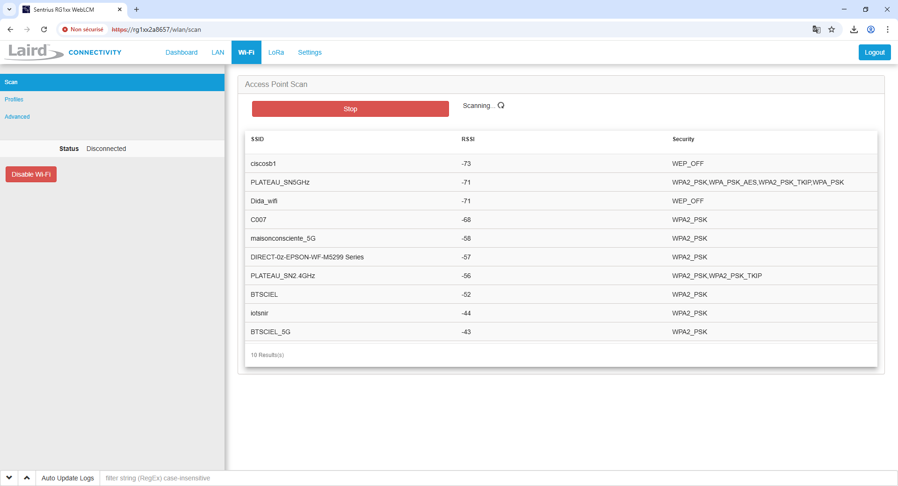
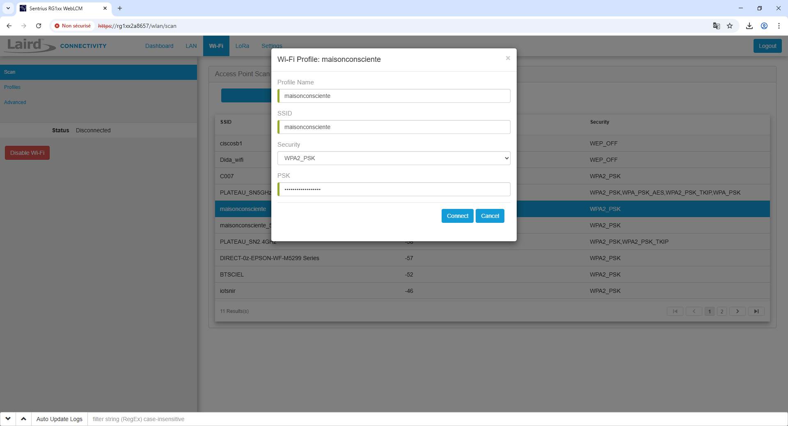
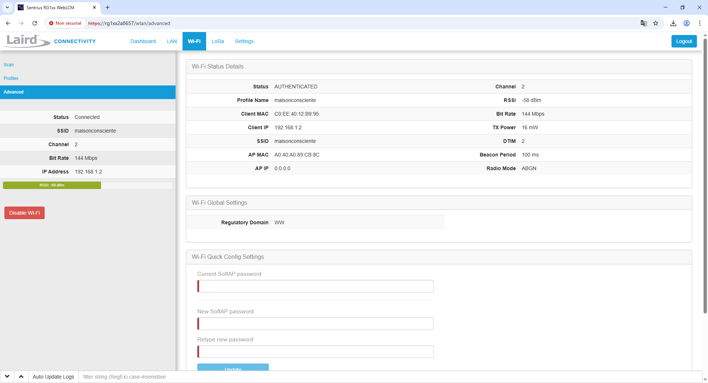

# Configuration de la passerelle LoRaWAN (Laird RG191)

Pour assurer la collecte et la transmission des données capteurs, nous avons choisi la passerelle industrielle **Laird RG191**, reconnue pour sa robustesse et sa compatibilité avec le protocole LoRaWAN. Cette passerelle permet de recevoir les données des capteurs sur de longues distances (plusieurs centaines de mètres) et de les transmettre de manière sécurisée vers notre serveur central.

## Modes de connexion réseau

La Laird RG191 offre plusieurs options de connexion réseau, adaptées à différents environnements :

- **Connexion Ethernet (RJ45)** : recommandée pour une stabilité et une fiabilité maximales.
- **Connexion Wi-Fi** :
  - **Mode client** : intégration dans un réseau Wi-Fi existant.
  - **Mode point d’accès (AP)** : création d’un réseau Wi-Fi dédié autour de la passerelle.

L’adresse IP de la passerelle peut être attribuée automatiquement via le serveur DHCP du réseau ou configurée manuellement dans l’interface d’administration. L’accès à cette interface se fait depuis un navigateur web, en utilisant les identifiants par défaut (à modifier pour des raisons de sécurité).

## Configuration LoRaWAN

Après connexion à l’interface web, il est nécessaire de configurer la passerelle pour qu’elle redirige les paquets LoRa reçus vers le serveur applicatif, ici un serveur **ChirpStack** déployé en local.

Les paramètres essentiels à renseigner sont :

- **Adresse IP du serveur ChirpStack**
- **Port UDP** (généralement 1700)
- **Fréquence régionale** (EU868 pour l’Europe)

Cette configuration permet à la passerelle de remplir pleinement son rôle de concentrateur LoRaWAN, en assurant l’acheminement fiable et efficace des données capteurs vers la plateforme d’analyse.

---

## Configuration du Wi-Fi

Si vous utilisez une passerelle avec Wi-Fi, configurez-la comme suit :

1. Accédez à la page de configuration de votre passerelle
2. Allez dans les paramètres Wi-Fi
3. Scannez les réseaux disponibles

4. Sélectionnez votre réseau et entrez vos identifiants

1. Une fois connecté, vérifiez l'état de la connexion

